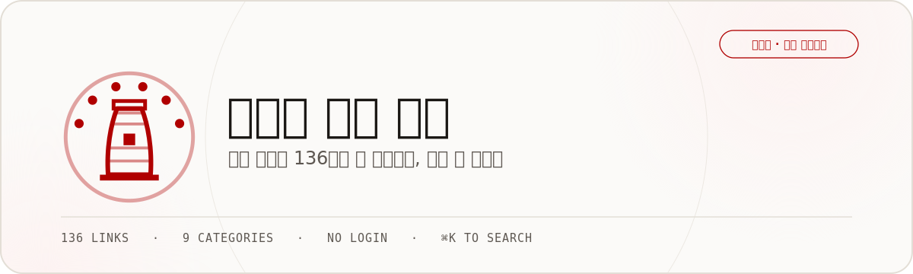
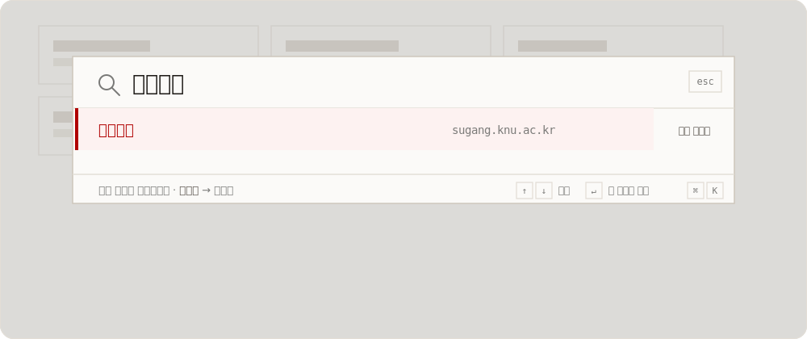
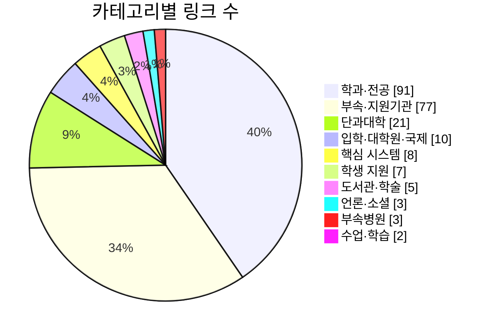
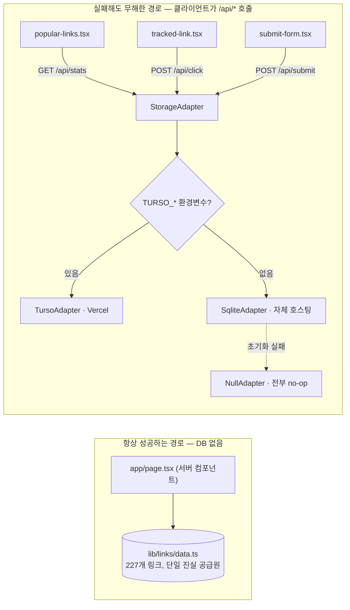
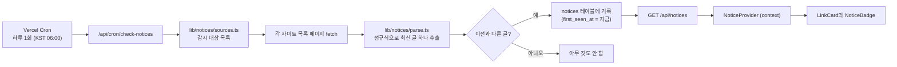
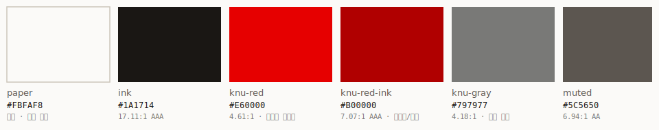

<div align="center">



<br/>


</div>

경북대학교 사이트마다 URL이 제각각이라 그때그때 검색해서 들어가곤 했습니다.
그래서 자주 찾는 사이트 227곳을 모아 검색 한 번으로 갈 수 있게 만들었습니다.
**공식 서비스가 아닌, 학생이 만든 개인 프로젝트입니다.**

<br/>

## 왜 필요한가요

경북대 사이트는 이름과 주소가 잘 안 이어집니다. 수강신청은 `sugang`, 성적 조회는
`knuin`, 강의는 `lms1`, 도서관은 `kudos`, 증명서 발급은 `certpia`. 단과대학도 마찬가지라
경상대학은 `cec`, 사범대학은 `knutc`, 예술대학은 `mvarts`입니다. 외울 수 있는 규칙이 없습니다.

| | 기존 방식 | 이 사이트 |
|---|---|---|
| 수강신청 페이지를 찾는다면 | 포털 로그인 → 검색 → 몇 번의 클릭 | `⌘K` → `ㅅㄱㅅㅊ` → `Enter` |
| 걸리는 조작 | 매번 다름, 매번 헤맴 | 세 번, 항상 같음 |

<br/>

## 이렇게 씁니다

초성만 쳐도 찾아냅니다. `ㅅㄱㅅㅊ`라고 치면 "수강신청"이 바로 위로 올라옵니다.
이름, 영문명, 흔히 쓰는 별칭까지 함께 뒤지기 때문에 정확한 이름을 몰라도 괜찮습니다.

<div align="center">

</div>

<br/>

## 무엇을 할 수 있나요

| | |
|---|---|
| **초성 검색** | `ㅅㄱㅅㅊ` → 수강신청, `ㄷㅅㄱ` → 도서관. 이름의 일부만 알아도 찾아집니다. |
| **즐겨찾기 · 최근 방문** | 로그인 없이 이 브라우저에만 저장됩니다. 다른 사람 계정과 섞이지 않습니다. |
| **많이 찾는 링크** | 요즘 다른 사람들이 자주 누르는 링크를 보여줍니다. 통계가 없어도 사이트는 멀쩡히 돌아갑니다 — 이 구획만 조용히 사라질 뿐입니다. |
| **빠진 링크 제보** | 필요한 사이트가 안 보이면 그 자리에서 바로 알려줄 수 있습니다. |
| **새 공지 표시** | 감시 대상 사이트(지금은 경북대 홈페이지·영문 홈페이지)에 새 글이 올라오면 카드에 작은 `new` 배지가 뜹니다. 하루 한 번 확인합니다. |
| **꾸준한 생존 확인** | `npm run healthcheck` 한 번으로 227개 링크가 실제로 살아있는지 전부 확인합니다. |

<br/>

## 227개 링크, 10개 갈래



학과·전공 홈페이지와 부속연구소가 가장 많고, 그만큼 이름이 낯설고 도메인도 제각각인 자리이기도
합니다. 사실 이 사이트가 가장 쓸모 있는 곳도 여기입니다 — 핵심 시스템 몇 개는 어차피 즐겨찾기
해두기 마련이지만, `se`가 소프트웨어학과이고 `knuin`이 성적 시스템이라는 건 매번 헷갈리니까요.

<br/>

## 시작하기

```bash
npm install
npm run dev        # http://localhost:3000
```

Node 24 이상이 필요합니다(`node:sqlite` 내장 모듈을 씁니다).

| 명령 | 하는 일 |
|---|---|
| `npm run dev` | 개발 서버를 띄웁니다 |
| `npm run build && npm start` | 프로덕션 빌드로 실행합니다 |
| `npm run check` | 타입 검사 + 린트 + 단위 테스트를 한 번에 |
| `npm test` | 초성 검색 랭커 단위 테스트만 |
| `npm run healthcheck` | 링크 227개가 실제로 살아있는지 확인 |

<br/>

---

## 더 깊이: 이 프로젝트가 지키는 것들

이 아래는 코드를 직접 열어볼 분들을 위한 내용입니다.

### 원칙 하나: 링크 렌더링은 절대 데이터베이스를 보지 않는다

이 프로젝트에서 가장 지키려 애쓴 규칙입니다. 데이터베이스가 지워지거나, 초기화에 실패하거나,
Vercel 서버리스 환경이라 파일시스템이 통째로 휘발되더라도 — **링크 목록·검색·즐겨찾기는
100% 그대로 동작해야 합니다.** 사라져도 되는 건 통계와 제보뿐입니다.



`data/knu.db`를 지우고 홈을 새로고침해도 링크 목록·검색·즐겨찾기는 그대로입니다.
사라지는 것은 "많이 찾는 링크" 구획뿐입니다. 세 어댑터 중 무엇이 붙어 있든 메서드는
예외를 던지지 않습니다 — 읽기는 빈 배열을, 쓰기는 조용한 실패를 돌려줍니다.

### 주요 파일

| 파일 | 역할 |
|---|---|
| `lib/links/data.ts` | 링크 227개. 실제로 접속을 확인한 URL만 넣습니다. |
| `lib/links/types.ts` | `KnuLink` 타입. `Category`가 판별 유니온이라 카테고리를 추가하면 라벨 누락을 컴파일러가 잡아줍니다. |
| `lib/search/rank.ts` | 초성 검색 랭커. 런타임 import가 없는 자기완결 모듈이라 `node --test`가 번들러 없이 바로 실행합니다. |
| `lib/db/index.ts` | 어댑터 팩토리. graceful degradation이 보증되는 지점입니다. |
| `lib/notices/sources.ts` | 공지사항을 감시할 사이트 목록. 로그인이 없는 곳만 있습니다. |
| `scripts/healthcheck.ts` | 링크 생존 확인 스크립트. 판정 규칙은 아래에. |

<details>
<summary><strong>링크를 추가하는 방법</strong></summary>

<br/>

`lib/links/data.ts`에 항목을 하나 더합니다. 규칙은 네 가지입니다.

1. **접속을 확인한 URL만.** 있을 법한 주소를 추측해서 넣지 않습니다.
2. **`id`는 절대 바꾸지 않습니다.** 클릭 통계의 키입니다. 학교가 URL을 바꿔도 `id`는 그대로 둡니다.
3. `keywords`에는 사람들이 실제로 칠 법한 말을 넣습니다. 초성은 `name`과 `keywords`에서
   자동으로 파생되므로 따로 적지 않습니다.
4. 카테고리를 새로 만들면 `lib/links/categories.ts`가 컴파일 에러로 라벨을 요구합니다.

</details>

<details>
<summary><strong>헬스체크의 판정 규칙</strong></summary>

<br/>

`npm run healthcheck`가 하는 판정입니다. 이 규칙이 이 스크립트가 존재하는 이유입니다.

| 상황 | 판정 |
|---|---|
| HTTP 응답을 받았다 (2xx·3xx·4xx·5xx 무관) | UP |
| TLS 인증서가 어긋났다 | WARN |
| DNS 실패 · 연결 거부 · 타임아웃 | DOWN |

**5xx는 DOWN이 아닙니다.** 서버가 무언가를 돌려줬다는 것은 서버가 살아있다는 뜻입니다.
실제로 `sugang`·`knuin`·`oz`는 브라우저가 아닌 요청에 HTTP 500을 돌려주지만 멀쩡히
서비스 중이고, `certpia`·`toegye`·`cmri`는 인증서 문제(이름 불일치 또는 만료)입니다.
"5xx = 죽은 링크"로 판정하면 이 여섯 곳을 매번 오탐합니다. 그래서 `data.ts`에
`healthException`을 박아 두고, 헬스체크는 그 예외를 알고 넘어갑니다. 반대로 예외가
붙어 있는데 이제 정상 응답한다면 스크립트가 알려줍니다 — 학교가 고쳤다는 뜻이고,
그때 `healthException`을 지웁니다.

실행 결과는 대략 이렇게 나옵니다(축약):

```text
$ npm run healthcheck

경북대 링크 227개를 확인합니다…

✓ knu-main               HTTP 200
✓ sugang                 HTTP 500 (알려진 예외 · 봇 차단/인증서)
✓ certpia                HTTP 200 (알려진 예외 · 봇 차단/인증서)
✓ kudos                  HTTP 200
  ⋮

── UP 134 · WARN 2 · DOWN 0 ──
```

</details>

<details>
<summary><strong>배포 — Vercel + Turso</strong></summary>

<br/>

Next.js 배포의 사실상 표준이라 무료 티어·Git 푸시 자동 배포·프리뷰 환경·글로벌 CDN이
딸려 옵니다. 문제는 Vercel 서버리스가 파일시스템을 휘발시킨다는 것 — 그래서
`data/knu.db`가 유지되지 않습니다. Turso(libSQL)는 SQLite와 SQL 방언이 호환되는
매니지드 서버리스 DB라서, `lib/db/turso-adapter.ts` 하나로 `StorageAdapter` 인터페이스를
그대로 구현했습니다.

**Vercel 설정**

1. [turso.tech](https://turso.tech)에서 DB를 만들고 `TURSO_DATABASE_URL`, `TURSO_AUTH_TOKEN`을 발급받습니다.
2. Vercel 프로젝트 환경변수에 두 값을 등록합니다.
3. 그걸로 끝입니다. `lib/db/index.ts`가 두 값을 보고 자동으로 Turso 어댑터를 씁니다.

환경변수가 없거나 Turso 연결에 실패하면 SQLite로, SQLite도 열 수 없으면 `NullAdapter`로
조용히 떨어집니다 — 어떤 경우든 링크 허브 본체(목록·검색·즐겨찾기)는 영향받지 않고,
사라지는 건 "많이 찾는 링크" 구획과 제보 기능뿐입니다.

**자체 호스팅을 원한다면**

영속 볼륨이 있는 Node 런타임(Railway·Fly.io·VPS 등)이라면 Turso 없이도 `node:sqlite`가
그대로 동작합니다. `TURSO_DATABASE_URL`을 설정하지 않으면 됩니다. DB 경로는
`KNU_DB_PATH` 환경변수로 옮길 수 있습니다(기본값 `data/knu.db`).

**제보 검토 — `/admin`**

`submissions` 테이블에 `status='pending'`으로 쌓이기만 합니다. 자동으로 게시되지
않으므로 검토는 직접 합니다. `/admin`에서 대기 중인 제보를 모아 보고, 각 URL의 생존을
그 자리에서 확인한 뒤, 두 가지 방법 중 하나로 반영합니다.

1. `ADMIN_SECRET` 환경변수(로컬 `.env.local`, Vercel 프로젝트 환경변수)에 비밀번호를
   정합니다. 이 값이 없으면 `/admin`은 404입니다 — 존재 자체가 감춰집니다.
2. `/admin`에 접속해 비밀번호로 로그인하고, 검토할 항목을 체크한 뒤 "전체 생존
   확인"으로 URL이 살아있는지 봅니다.
3. **반영 방법 A — 자동 ("바로 반영")**: `GITHUB_TOKEN` 환경변수가 설정돼 있으면
   나타나는 버튼입니다. 누르면 서버가 GitHub API로 `lib/links/data.ts`를 직접 고쳐
   `main`에 커밋하고, Vercel이 자동 재배포합니다. 죽은 URL은 자동으로 걸러지고,
   `id`는 기존 값과 겹치지 않게 자동으로 조정됩니다. 커밋된 제보는 곧바로 "완료"로
   넘어갑니다.
4. **반영 방법 B — 수동 ("코드로 내보내기")**: `GITHUB_TOKEN`이 없거나, 직접 검토한
   뒤 붙여넣고 싶을 때 씁니다. `KnuLink` 리터럴 TS 코드가 나오면 복사해서
   `lib/links/data.ts`에 붙여넣고 `id`·`campus`·`keywords`를 다듬은 다음 직접
   커밋합니다. 붙여넣고 커밋했으면 `/admin`에서 그 항목을 "완료로 표시"합니다.
5. 어느 쪽이든, 쓰지 않기로 한 제보는 "반려"로 남겨 목록에서 뺍니다.

`GITHUB_TOKEN`은 **이 저장소 하나만** 건드릴 수 있는 fine-grained PAT로 발급해야
합니다(Settings → Developer settings → Fine-grained tokens, 저장소를
`conny3233/knu_website` 하나만 선택, 권한은 `Contents: Read and write`만). 비밀번호로
보호된 화면이지만 공개 웹이 쥔 토큰이므로, 새는 경우의 피해 범위를 이 저장소로
좁혀 둔 것입니다.

SQL로 직접 보고 싶다면 이렇게도 가능합니다:

```bash
# SQLite (자체 호스팅)
sqlite3 data/knu.db "SELECT id, name, url, category, note FROM submissions WHERE status='pending';"

# Turso
turso db shell <db-이름> "SELECT id, name, url, category, note FROM submissions WHERE status='pending';"
```

</details>

<details>
<summary><strong>새 공지 표시가 동작하는 방식</strong></summary>

<br/>

227개 링크 전부를 감시하지 않습니다. **못 합니다.** 대부분(포털·수강신청·통합정보시스템·
웹메일·LMS 등)은 로그인 게이트 뒤에 있어 비로그인으로는 공지 목록조차 안 보이고,
도서관·챗봇은 서버 렌더링 없는 SPA라 이 방식(HTML 파싱)으로는 읽을 수 없습니다.
실제로 확인해보고 되는 두 곳만 `lib/notices/sources.ts`에 등록했습니다 — 경북대학교
홈페이지(학사공지)와 영문 홈페이지.



한 사이트가 실패해도(마크업이 바뀌었다거나, 응답이 느리다거나) 나머지는 그대로
진행됩니다 — 배지 하나가 안 뜨는 것이지 cron 전체나 사이트가 죽을 이유가 없습니다.
"새 글" 판정은 발견된 지 3일 이내(`NOTICE_NEW_WINDOW_MS`)인 것만입니다. 로그인이
없는 사이트라 "누가 이미 봤는지"는 추적하지 않습니다 — 모두에게 같은 배지가 보입니다.

**Vercel에 배포한다면**: `CRON_SECRET` 환경변수를 하나 설정해 두면
`/api/cron/check-notices`가 그 값과 일치하는 `Authorization: Bearer` 헤더가 있을
때만 응답합니다. 설정하지 않으면(로컬 개발) 검증 없이 열려 있어 `curl`로 바로
찔러볼 수 있습니다. `vercel.json`의 크론 스케줄은 UTC라 `0 21 * * *`가 KST 06:00입니다.

새 사이트를 감시 대상에 넣으려면 그 사이트의 공지 목록 페이지를 curl로 받아
마크업을 확인하고, `lib/notices/parse.ts`에 파서를 하나 더한 뒤
`lib/notices/sources.ts`에 항목을 추가하면 됩니다.

</details>

<details>
<summary><strong>만들면서 내린 선택</strong></summary>

<br/>

- **`node:sqlite`** (Node 24 내장). `better-sqlite3`는 네이티브 모듈이라 Windows에서
  빌드 도구를 요구합니다. 아직 실험적 API라 실행할 때 경고가 한 줄 뜹니다.
- **`node --test`가 TypeScript를 그대로 실행합니다.** jest·vitest·tsx 전부 필요
  없습니다. 다만 ESM 해석이라 확장자를 요구하므로 테스트 파일만 `./rank.ts`처럼
  확장자를 적습니다(`tsconfig.json`의 `allowImportingTsExtensions`).
- **검색 라이브러리를 쓰지 않습니다.** 링크가 100여 개라 O(n) 스캔이 사실상
  공짜고, 범용 퍼지 검색기는 한글 초성을 모릅니다. 어차피 초성 문자열을 직접
  만들어 먹여야 하므로, 그럴 바에는 점수 체계 전체를 쥐는 편이 단순합니다.
- **⌘K 팔레트는 `cmdk`를 쓰되 `shouldFilter={false}`로 필터링을 끕니다.**
  포커스 트랩·`role=combobox`·키보드 내비게이션은 검증된 라이브러리에 맡기고,
  랭킹만 `lib/search/rank.ts`가 합니다.
- **클릭 추적은 `onMouseDown` + `sendBeacon`.** `preventDefault`를 하지 않으므로
  좌클릭·휠클릭·새 탭이 전혀 방해받지 않습니다.
- **즐겨찾기·최근 방문은 `useSyncExternalStore`.** 서버 스냅샷이 빈 배열이라
  하이드레이션 불일치가 구조적으로 없습니다.
- **공지 파서는 cheerio 없이 정규식으로 씁니다.** 감시 대상이 둘뿐이고 마크업이
  고정적이라, HTML 파서 의존성 하나를 새로 들이는 것보다 정규식 두 벌이 더
  단순합니다. 대상이 훨씬 늘어나면 그때 재고할 문제입니다.

</details>

<br/>

## 디자인

경북대 공식 CI는 CMYK와 Pantone만 공개하고 HEX는 공개하지 않습니다. CMYK를 변환해
쓰되 역할별로 대비를 계산해 나눴습니다.

<div align="center">

</div>

공식 지정서체(윤고딕540 / DIN-Regular)는 둘 다 상용이라 쓸 수 없습니다.
국문은 **Pretendard**(OFL), 표제 숫자·영문은 **Newsreader**, 호스트명은
**IBM Plex Mono**가 맡습니다.

로고·워드마크·마스코트(호반우)는 경북대학교 **공식 UI 자산**을 씁니다
(`public/brand/`, 상징·캐릭터 공식 다운로드). 히어로의 성도(星圖)만은 첨성대와 개교
당시 5개 단과대학·1개 대학원을 뜻하는 6개의 별을 직접 SVG로 그린 장식입니다
(`components/star-chart.tsx`). 비공식 사이트임은 푸터에 명시합니다.

<br/>

---

<div align="center">
<sub>
이 사이트는 학생이 만든 비공식 프로젝트이며 경북대학교의 공식 서비스가 아닙니다.<br/>
모든 링크는 각 기관의 공식 주소로 바로 이어집니다.
</sub>
</div>
